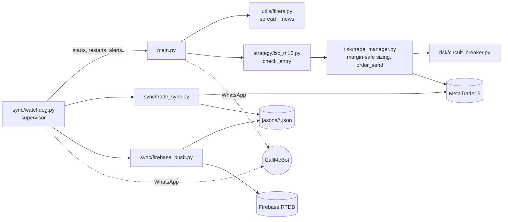

# MIDAS — Liquidity-Sweep Continuation


Single-strategy algorithmic gold bot for MetaTrader 5, built to run unattended
24/7 on a dedicated Windows box. One entry point (`main.py`), one validated
strategy (`strategy/lsc_m15.py`), 26 files on the live path.

The earlier dual-bot system (Bot 1 structural bias + Bot 2 volatility regime)
was retired after proper backtesting found no edge. LSC is the strategy that
survived in-sample / out-of-sample validation, split-window checks and a
1000-shuffle Monte Carlo stress test.

> **This README is generated.** Every parameter and metric below is read from
> `config/settings.py`, `sync/watchdog.py`, `utils/logger.py` and
> `research/lsc_validation_2026-09-08.txt` by `research/tools/build_readme.py`. Re-run it after
> changing any of them; `--check` exits 1 if it is stale.

---

## Validated performance

Frozen-data backtest, 90,000 M15 bars of `XAUUSD.a` (2022-11-11 08:15 → 2026-09-08 13:45 UTC),
run 2026-09-08. Both harnesses (the calibrator loop and `backtest/lsc_engine.py`)
reproduce the same trade list; the hash is checked after every refactor.

| Metric | Value |
|--------|-------|
| Account / leverage | $50,000 at 1:10 |
| Risk per trade | 0.045% (margin-capped) |
| Drawdown wall calibrated against | 6% trailing |
| Trades | 2,649 |
| Profit factor | **1.08** |
| Win rate | 38.8% |
| Net P&L | $3,119.68 |
| Max drawdown | 6.00% |
| Final balance | $53,119.68 |

Read that PF for what it is: a thin, positive edge at a risk setting chosen so
the worst of 1000 shuffled sequences stays inside the drawdown wall, not a
money machine. Full output: `research/lsc_validation_2026-09-08.txt`.

---

## How it trades

When price sweeps beyond the prior UTC day's high or low and then **closes
convincingly beyond that level in the sweep direction**, LSC treats it as
continuation, not exhaustion, and enters on the next bar with a static SL/TP.

| Parameter | Value | Source in `config/settings.py` |
|-----------|-------|--------------------------------|
| Symbol / timeframe | `XAUUSD.a` / M15 | `SYMBOL`, `SIGNAL_TIMEFRAME` |
| Close-beyond confirmation | 0.2 × ATR14 past the prior-day level | `CLOSE_BEYOND_ATR_MULT` |
| Stop loss | prior-day level ∓ 0.3 × ATR14 | `SL_BUFFER_ATR_MULT` |
| Take profit | 2.0 × SL distance | `REWARD_RATIO` |
| Cooldown after a trade | 3 bars | `COOLDOWN_BARS` |
| Max trades per day | 4 | `MAX_TRADES_PER_DAY` |
| Session (UTC) | 00:00–14:59 and 20:00–23:59 | `ALLOWED_SESSIONS` → `SESSION_HOURS` |
| Hard time exit | 24 h (backtest hold cap 96 bars) | `MAX_TRADE_HOURS_HARD` |
| Friday | no entries from 20:00 UTC, force-flat from 21:00 UTC | `FRIDAY_CUTOFF_HOUR`, `FRIDAY_CLOSE_HOUR` |
| Loop interval | 60 s (signal evaluated once per closed bar) | `LOOP_INTERVAL_SECONDS` |

The live loop and the backtest call the **same** `precompute()` / `check_entry()`
and read the same `SESSION_HOURS`; there is no separate live approximation.

---

## Architecture



One command runs the box. The watchdog starts main.py, sync/trade_sync.py, sync/firebase_push.py, pins their working
directory to the repo root, restarts any that exit with exponential back-off
(10 s doubling to 600 s, reset after 600 s of healthy uptime,
**no restart cap**), sends a WhatsApp alert on every restart, and terminates all
three when it is stopped. `main.py` itself never gives up on MT5 either: it
reconnects with back-off (10 s doubling to 300 s) and alerts on outage
start and recovery.

```bash
python sync/watchdog.py
```

Logs: `logs/<process>.log`, rotated at midnight UTC, 30 days kept.
Runtime state: `jasons/` (git-ignored).

<details>
<summary><strong>Live file structure (26 files, walked from disk)</strong></summary>

```
.gitignore
backtest/lsc_engine.py            LSC's exact backtest harness (main.py also imports compute_atr14 from it)
CLAUDE.md
config/.env.example               Template for config/.env (git-ignored)
config/settings.py                Single source of truth for every parameter below
config/settings_diagnostic.py     Isolated diagnostic-account config (own MAGIC, MT5_DIAGNOSTIC_* creds)
main.py                           Live loop: one LSC signal check per closed M15 bar
README.md                         Generated by research/tools/build_readme.py
requirements.txt                  Live dependencies only
risk/circuit_breaker.py           Consecutive-loss / daily-loss pause, resets at midnight UTC
risk/trade_manager.py             Order send, margin-safe lot sizing, closed-trade detection
strategy/lsc_m15.py               The strategy: precompute() + check_entry(), pure functions on a DataFrame
sync/firebase_push.py             Pushes jasons/ state to Firebase for remote monitoring
sync/trade_sync.py                Writes jasons/ state files, hourly WhatsApp summary
sync/watchdog.py                  Supervisor: starts and restarts the three live processes
tools/preflight_check.py          Go / no-go checker run before launch
utils/filters.py                  Spread filter + news filter wrapper
utils/logger.py                   Per-process rotating log file + console
utils/mt5_connection.py           connect / disconnect
utils/news_filter.py              Finnhub high-impact US event blackout (fails closed)
utils/notifications.py            WhatsApp (CallMeBot) alerts
```

`research/` holds 31 Python files of dev tooling (risk calibrator, backtest
engines, the strategy tournament and its results) that never run on the live
box. See `research/requirements.txt`.

</details>

---

## Safety mechanisms

| Mechanism | Trigger | Action |
|-----------|---------|--------|
| Circuit breaker | 4 consecutive losses OR 5.0% daily loss | No new trades until midnight UTC, WhatsApp alert |
| Spread filter | spread > 20 points | Skip signal |
| News filter | ±30 min of a high-impact US event, **or feed unavailable** | Skip signal (fails closed) |
| Session filter | outside 00:00–14:59 and 20:00–23:59 UTC | Skip signal |
| Margin-safe sizing | risk-% lot would use > 25% of equity as margin | Lot capped, computed live from balance / leverage / price |
| Time exit | position open ≥ 24 h | Force close |
| Friday / weekend | after 20:00 UTC Friday or any weekend hour | No entries; force-flat after 21:00 UTC |
| Config fail-fast | `MT5_LOGIN` missing | `config/settings.py` exits at import; nothing prompts for input |

<details>
<summary><strong>Full rule list, in loop order</strong></summary>

1. If the circuit breaker is tripped, do nothing this cycle.
2. Enforce the hard time exit on any open position older than 24 h.
3. Detect positions that closed since the last cycle; record P&L in the breaker and alert.
4. Weekend, or Friday from 21:00 UTC: force-close everything, stop.
5. Friday from 20:00 UTC: no new entries.
6. Daily cap (4) reached, hour outside the session, spread over 20 points, or news blackout: no signal.
7. Fetch M15 bars; only evaluate when a new bar has closed.
8. `check_entry()`: cooldown (3 bars), warm-up, then sweep-and-close-beyond test → BUY / SELL / NEUTRAL with SL and TP.
9. Lot = min(risk-% lot, margin-safe ceiling, broker max), floored at broker min, rounded to step.
10. Send the order with the strategy's SL/TP; on success count the trade and alert.

</details>

---

## Setup

- Windows, Python 3.10+, MetaTrader 5 installed and logged in, `XAUUSD.a` visible in Market Watch.
- `pip install -r requirements.txt` on the box; add `-r research/requirements.txt` on a dev machine.
- Copy `config/.env.example` to `config/.env`: MT5 credentials, `FINNHUB_API_KEY`
  (**required**, the news filter fails closed without it), WhatsApp phone + CallMeBot
  key, `FIREBASE_DB_URL`.
- Go / no-go before launch:

```bash
python tools/preflight_check.py                      # production config
python tools/preflight_check.py --config diagnostic  # diagnostic account
```

Exit code 0 = go (warnings allowed), 1 = any FAIL.

---

## Disclaimer

**This is experimental research software, not an investment product.**

- It is provided for educational and personal research purposes only and is
  not financial advice.
- Every figure above is a **hypothetical backtest** on historical data with an
  assumed spread. Backtests do not account for slippage, requotes, outages,
  broker behaviour or regime change, and past performance does not guarantee
  future results.
- Algorithmic trading on leveraged instruments carries a real risk of losing
  the entire account. A profit factor of 1.08 is a thin edge that can turn
  negative in a different market regime.
- The author is not a licensed financial adviser. Never trade with money you
  cannot afford to lose. Use at your own risk.

*Built by James Carragher | MIDAS Capital*
